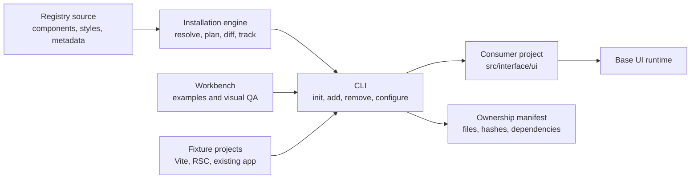

Compared with shadcn/ui, the proposed system differs in these ways:

- **Single namespace API:** `import { ui } from "..."` followed by `<ui.button />`, `<ui.select />`, etc., instead of individual component imports.
- **Lowercase, HTML-shaped vocabulary:** Components resemble native elements rather than PascalCase catalog components.
- **Base UI throughout:** Base UI provides the accessible behavioral foundation behind the public components.
- **Simplified composite APIs:** Consumers should not need to assemble every Base UI portal, positioner, popup, and trigger for common cases.
- **Data-driven styling:** Variants and state use controlled props and `data-*` attributes instead of ad hoc Tailwind class strings.
- **Agent-first authoring:** Agents learn one import and a small, predictable vocabulary rather than scattered paths and component conventions.
- **System-oriented installation:** The CLI installs, removes, and configures a coherent UI system, not merely copies isolated component files.
- **Purpose-based source organization:** Installed files belong in meaningful areas such as controls, selection, overlays, and styling—not a flat `components/ui` directory.
- **Central tokens and themes:** Visual decisions are configured at the system level rather than repeated across copied component recipes.
- **Editable application-owned source:** Components remain locally modifiable, preserving shadcn’s ownership model without editing `node_modules`.
- **Base UI stays internal:** Application screens import your `ui` API rather than importing Base UI directly.
- **Optional advanced escape hatches:** Direct or compound primitive access can exist for complex cases without becoming the default authoring experience.

In short: retain shadcn’s CLI-driven, source-owned distribution model, but replace its component catalog and flat file dumping with a Base UI-backed, namespace-driven, centrally configured interface system.

Assumptions for this proposal:

- React and TypeScript only for v1.
- Base UI is the behavioral dependency.
- Components are copied into the consumer’s repository and remain editable.
- Styling uses plain CSS, custom properties, classes, and `data-*` state—not Tailwind as an internal requirement.
- The CLI owns deterministic installation, removal, configuration, and upgrades.
- Exact product/package naming remains undecided.

## Recommended repository shape

```text
frontend-lib/
├─ apps/
│  └─ workbench/
│     ├─ src/
│     │  ├─ examples/
│     │  ├─ accessibility/
│     │  └─ installed-ui/
│     └─ tests/
│
├─ packages/
│  ├─ cli/
│  │  └─ src/
│  │     ├─ commands/
│  │     │  ├─ init.ts
│  │     │  ├─ add.ts
│  │     │  ├─ remove.ts
│  │     │  ├─ configure.ts
│  │     │  ├─ update.ts
│  │     │  └─ doctor.ts
│  │     ├─ output/
│  │     └─ index.ts
│  │
│  └─ engine/
│     └─ src/
│        ├─ config/
│        ├─ registry/
│        ├─ planning/
│        ├─ installation/
│        ├─ removal/
│        ├─ dependencies/
│        ├─ package-manager/
│        ├─ manifest/
│        └─ index.ts
│
├─ registry/
│  ├─ foundation/
│  │  ├─ registry.json
│  │  ├─ namespace/
│  │  ├─ styles/
│  │  └─ utilities/
│  │
│  ├─ controls/
│  │  ├─ registry.json
│  │  ├─ button/
│  │  ├─ input/
│  │  └─ toggle/
│  │
│  ├─ forms/
│  │  ├─ registry.json
│  │  ├─ field/
│  │  ├─ checkbox/
│  │  ├─ radio-group/
│  │  ├─ select/
│  │  └─ number-field/
│  │
│  ├─ overlays/
│  │  ├─ registry.json
│  │  ├─ dialog/
│  │  ├─ popover/
│  │  ├─ tooltip/
│  │  └─ drawer/
│  │
│  ├─ navigation/
│  │  ├─ registry.json
│  │  ├─ menu/
│  │  ├─ tabs/
│  │  └─ accordion/
│  │
│  ├─ feedback/
│  │  ├─ registry.json
│  │  ├─ progress/
│  │  ├─ toast/
│  │  └─ alert-dialog/
│  │
│  └─ data-display/
│     ├─ registry.json
│     ├─ table/
│     └─ meter/
│
├─ tests/
│  ├─ fixtures/
│  │  ├─ vite-react/
│  │  ├─ next-rsc/
│  │  └─ existing-project/
│  ├─ installation/
│  ├─ removal/
│  ├─ upgrades/
│  └─ snapshots/
│
├─ scripts/
├─ registry.json
├─ package.json
├─ pnpm-workspace.yaml
├─ turbo.json
├─ tsconfig.json
└─ README.md
```

The category directories should only be created when the first component in that category exists. The tree above shows the intended destination, not the initial scaffold.

Shadcn’s registry format now supports composing a root registry from nested `registry.json` files, so our purpose-based organization is compatible with its useful registry concepts without inheriting `components/ui`. [Registry composition documentation](https://ui.shadcn.com/docs/registry/registry-json)

## How the pieces relate



The important boundary is that `packages/engine` contains the real behavior. `packages/cli` is mostly command parsing, prompts, and readable output. This makes installation and removal independently testable without running an interactive terminal.

## What gets installed into a user project

```text
consumer-project/
├─ src/
│  └─ interface/
│     └─ ui/
│        ├─ index.ts
│        ├─ controls/
│        │  ├─ button.tsx
│        │  └─ input.tsx
│        ├─ forms/
│        │  ├─ field.tsx
│        │  └─ select/
│        ├─ overlays/
│        │  └─ dialog/
│        ├─ styles/
│        │  ├─ tokens.css
│        │  ├─ theme.css
│        │  └─ components.css
│        └─ internal/
│           └─ classnames.ts
│
├─ ui.config.json
└─ ui.lock.json
```

Application code sees:

```tsx
import { ui } from "@/interface/ui";
```

The namespace file is generated from installed items. Adding `select` adds `ui.select`; removing it removes that namespace entry.

Two configuration files serve different purposes:

- `ui.config.json` is human-editable: installation path, import alias, theme, styling mode, RSC support and package-manager preferences.
- `ui.lock.json` is machine-managed: installed items, registry versions, file ownership, hashes and dependency relationships.

That lock file is essential for safe removal. Without it, the CLI cannot reliably distinguish library-owned files from unrelated or modified application code.

## Dependency stack

| Area | Proposed dependencies | Reason |
|---|---|---|
| Workspace | pnpm workspaces | Mature monorepo support and consistent package-manager behavior |
| Task orchestration | Turborepo | Shared build, test and typecheck pipeline across packages and workbench |
| Language | TypeScript | CLI, registry metadata, components and tests |
| Component behavior | `@base-ui/react` | Accessible interaction, state, focus, portals and composition |
| Rendering peers | `react`, `react-dom` | Consumer peer dependencies and workbench runtime |
| Styling | Plain CSS and custom properties | Framework-neutral styling contract; no mandatory Tailwind |
| CLI parsing | `commander` | Stable command and option parsing |
| Validation | `zod` | Configuration, registry and manifest validation |
| Prompts | `@clack/prompts` or `prompts` | Interactive confirmations and selections |
| Process execution | `execa` | Package-manager and formatter commands |
| File discovery | `fast-glob` | Project and registry file resolution |
| Diffing | `diff` | Dry runs, conflict previews and modified-file detection |
| CLI build | `tsup` | Small distributable Node executable |
| Unit tests | Vitest | Engine, schemas, planning and filesystem tests |
| Browser tests | Playwright | Installed component behavior and keyboard interaction |
| Accessibility | `@axe-core/playwright` | Automated checks in the real rendered workbench |
| Component tests | Testing Library | Focused interaction and semantic tests |
| Formatting | Prettier | Repository formatting and optional generated-file formatting |
| Releases | Changesets | CLI versioning and package publication |

Shadcn currently uses pnpm workspaces, Turborepo, Commander, Zod, Execa, Vitest and tsup, so these are proven choices for this type of distribution platform. We should adopt the useful infrastructure without copying its entire dependency surface. [Current shadcn repository](https://github.com/shadcn-ui/ui), [CLI package manifest](https://raw.githubusercontent.com/shadcn-ui/ui/main/packages/shadcn/package.json)

Dependencies I would deliberately omit initially:

- Tailwind and `tailwind-merge`
- CVA or another variant recipe library
- Storybook
- Babel, Recast and ts-morph
- A mandatory icon library
- A documentation framework separate from the workbench
- Multiple framework adapters

Data attributes and CSS selectors can handle initial variants without CVA. Namespace files and other fully owned files can be regenerated deterministically, avoiding AST rewriting until we confirm a real need.

## CLI responsibilities

```text
init
  Detect project → write config → install foundation → configure CSS/imports

add
  Resolve item graph → preview changes → install files/dependencies
  → regenerate namespace → update lock

remove
  Read ownership graph → detect user modifications → remove safe files
  → remove unused dependencies → regenerate namespace → update lock

configure
  Change theme, paths or settings → calculate migration → preview → apply

update
  Compare registry versions and local hashes → show diff → apply selected changes

doctor
  Validate config, dependencies, namespace, imports, manifest and file drift
```

Shadcn already provides useful `init`, `add`, dry-run and diff concepts. Our meaningful extension is treating removal, ownership, drift and configuration migration as first-class operations. [Shadcn CLI reference](https://ui.shadcn.com/docs/cli)
