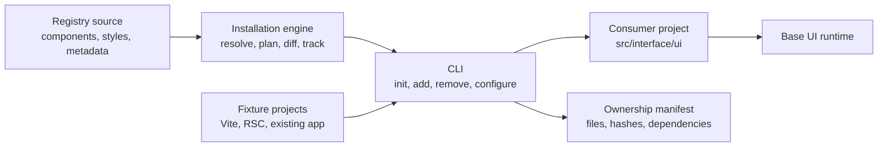

# Updated component baseline, 2026-10-09

Interface now adapts [Fluid Functionalism](https://github.com/mickadesign/fluid-functionalism) instead of designing its component catalog from scratch. The original proposal below remains historical design rationale for the namespace, source ownership, engine, and editor. Any statement below about creating bespoke components is superseded by this decision.

The pinned MIT reference is in `vendor/fluid-functionalism/` (commit `bf9ece46728035afef54feef6ac67e1f413cc0b0`). Adapt the upstream **Base UI** implementations and shared design systems into `registry/src/`, retaining one production component path, `ui.*`, `data-ui`, and the existing engine/CLI. The Radix implementations are not an alternate application mode.

The local tweakcn-derived editor is the design-system editor. Its validated theme adapter maps into the Interface-owned token variables consumed by the adapted components, and its preview renders canonical registry source. The upstream Tailwind class recipes are translated to semantic CSS for consumer installation, keeping one styling contract with no Tailwind requirement for installed components.

Migration sequence: pin source, port button and token preview, verify engine/consumer installation, then port complete upstream component groups and shared behaviors in reviewable increments. Replace existing production components rather than maintaining a second runtime.

---

Compared with shadcn/ui, the proposed system differs in these ways:

- **Single namespace API:** `import { ui } from "..."` followed by `<ui.button />`, `<ui.select />`, etc., instead of individual component imports.
- **Lowercase, HTML-shaped vocabulary:** Components resemble native elements rather than PascalCase catalog components.
- **Base UI throughout:** Base UI provides the accessible behavioral foundation behind the public components.
- **Simplified composite APIs:** Consumers should not need to assemble every Base UI portal, positioner, popup, and trigger for common cases.
- **Data-driven styling:** Variants and state use controlled props and `data-*` attributes instead of ad hoc Tailwind class strings.
- **Agent-first authoring:** Agents learn one import and a small, predictable vocabulary rather than scattered paths and component conventions.
- **System-oriented installation:** The CLI installs, removes, and configures a coherent UI system, not merely copies isolated component files.
- **Purpose-based source organization:** Installed files belong in meaningful areas such as controls, selection, overlays, and styling—not a flat `components/ui` directory.
- **Central tokens and themes:** Visual decisions are configured at the system level rather than repeated across copied component recipes.
- **Editable application-owned source:** Components remain locally modifiable, preserving shadcn’s ownership model without editing `node_modules`.
- **Base UI stays internal:** Application screens import your `ui` API rather than importing Base UI directly.
- **Optional advanced escape hatches:** Direct or compound primitive access can exist for complex cases without becoming the default authoring experience.

In short: retain shadcn’s CLI-driven, source-owned distribution model, but replace its component catalog and flat file dumping with a Base UI-backed, namespace-driven, centrally configured interface system.

Assumptions for this proposal:

- React and TypeScript only for v1.
- Base UI is the behavioral dependency.
- Components are copied into the consumer’s repository and remain editable.
- Styling uses plain CSS, custom properties, classes, and `data-*` state—not Tailwind as an internal requirement.
- The CLI owns deterministic installation, removal, configuration, and upgrades.
- Exact product/package naming remains undecided.

## Recommended repository shape

```text
frontend-lib/
├─ apps/
│  └─ editor/
│
├─ packages/
│  ├─ cli/
│  │  └─ src/
│  │     ├─ commands/
│  │     │  ├─ init.ts
│  │     │  ├─ add.ts
│  │     │  ├─ remove.ts
│  │     │  ├─ configure.ts
│  │     │  ├─ update.ts
│  │     │  └─ doctor.ts
│  │     ├─ output/
│  │     └─ index.ts
│  │
│  └─ engine/
│     └─ src/
│        ├─ config/
│        ├─ registry/
│        ├─ planning/
│        ├─ installation/
│        ├─ removal/
│        ├─ dependencies/
│        ├─ package-manager/
│        ├─ manifest/
│        └─ index.ts
│
├─ registry/
│  ├─ foundation/
│  │  ├─ registry.json
│  │  ├─ namespace/
│  │  ├─ styles/
│  │  └─ utilities/
│  │
│  ├─ controls/
│  │  ├─ registry.json
│  │  ├─ button/
│  │  ├─ input/
│  │  └─ toggle/
│  │
│  ├─ forms/
│  │  ├─ registry.json
│  │  ├─ field/
│  │  ├─ checkbox/
│  │  ├─ radio-group/
│  │  ├─ select/
│  │  └─ number-field/
│  │
│  ├─ overlays/
│  │  ├─ registry.json
│  │  ├─ dialog/
│  │  ├─ popover/
│  │  ├─ tooltip/
│  │  └─ drawer/
│  │
│  ├─ navigation/
│  │  ├─ registry.json
│  │  ├─ menu/
│  │  ├─ tabs/
│  │  └─ accordion/
│  │
│  ├─ feedback/
│  │  ├─ registry.json
│  │  ├─ progress/
│  │  ├─ toast/
│  │  └─ alert-dialog/
│  │
│  └─ data-display/
│     ├─ registry.json
│     ├─ table/
│     └─ meter/
│
├─ tests/
│  ├─ fixtures/
│  │  ├─ vite-react/
│  │  ├─ next-rsc/
│  │  └─ existing-project/
│  ├─ installation/
│  ├─ removal/
│  ├─ upgrades/
│  └─ snapshots/
│
├─ scripts/
├─ registry.json
├─ package.json
├─ pnpm-workspace.yaml
├─ turbo.json
├─ tsconfig.json
└─ README.md
```

The category directories should only be created when the first component in that category exists. The tree above shows the intended destination, not the initial scaffold.

Shadcn’s registry format now supports composing a root registry from nested `registry.json` files, so our purpose-based organization is compatible with its useful registry concepts without inheriting `components/ui`. [Registry composition documentation](https://ui.shadcn.com/docs/registry/registry-json)

## How the pieces relate



The important boundary is that `packages/engine` contains the real behavior. `packages/cli` is mostly command parsing, prompts, and readable output. This makes installation and removal independently testable without running an interactive terminal.

## What gets installed into a user project

```text
consumer-project/
├─ src/
│  └─ interface/
│     └─ ui/
│        ├─ index.ts
│        ├─ controls/
│        │  ├─ button.tsx
│        │  └─ input.tsx
│        ├─ forms/
│        │  ├─ field.tsx
│        │  └─ select/
│        ├─ overlays/
│        │  └─ dialog/
│        ├─ styles/
│        │  ├─ tokens.css
│        │  ├─ theme.css
│        │  └─ components.css
│        └─ internal/
│           └─ classnames.ts
│
├─ ui.config.json
└─ ui.lock.json
```

Application code sees:

```tsx
import { ui } from "@/interface/ui";
```

The namespace file is generated from installed items. Adding `select` adds `ui.select`; removing it removes that namespace entry.

Two configuration files serve different purposes:

- `ui.config.json` is human-editable: installation path, import alias, theme, styling mode, RSC support and package-manager preferences.
- `ui.lock.json` is machine-managed: installed items, registry versions, file ownership, hashes and dependency relationships.

That lock file is essential for safe removal. Without it, the CLI cannot reliably distinguish library-owned files from unrelated or modified application code.

## Dependency stack

| Area               | Proposed dependencies           | Reason                                                               |
| ------------------ | ------------------------------- | -------------------------------------------------------------------- |
| Workspace          | pnpm workspaces                 | Mature monorepo support and consistent package-manager behavior      |
| Task orchestration | Turborepo                       | Shared build, test and typecheck pipeline across packages and editor |
| Language           | TypeScript                      | CLI, registry metadata, components and tests                         |
| Component behavior | `@base-ui/react`                | Accessible interaction, state, focus, portals and composition        |
| Rendering peers    | `react`, `react-dom`            | Consumer peer dependencies and test runtime                          |
| Styling            | Plain CSS and custom properties | Framework-neutral styling contract; no mandatory Tailwind            |
| CLI parsing        | `commander`                     | Stable command and option parsing                                    |
| Validation         | `zod`                           | Configuration, registry and manifest validation                      |
| Prompts            | `@clack/prompts` or `prompts`   | Interactive confirmations and selections                             |
| Process execution  | `execa`                         | Package-manager and formatter commands                               |
| File discovery     | `fast-glob`                     | Project and registry file resolution                                 |
| Diffing            | `diff`                          | Dry runs, conflict previews and modified-file detection              |
| CLI build          | `tsup`                          | Small distributable Node executable                                  |
| Unit tests         | Vitest                          | Engine, schemas, planning and filesystem tests                       |
| Browser tests      | Playwright                      | Installed component behavior and keyboard interaction                |
| Accessibility      | `@axe-core/playwright`          | Automated checks in rendered consumer fixtures                       |
| Component tests    | Testing Library                 | Focused interaction and semantic tests                               |
| Formatting         | Prettier                        | Repository formatting and optional generated-file formatting         |
| Releases           | Changesets                      | CLI versioning and package publication                               |

Shadcn currently uses pnpm workspaces, Turborepo, Commander, Zod, Execa, Vitest and tsup, so these are proven choices for this type of distribution platform. We should adopt the useful infrastructure without copying its entire dependency surface. [Current shadcn repository](https://github.com/shadcn-ui/ui), [CLI package manifest](https://raw.githubusercontent.com/shadcn-ui/ui/main/packages/shadcn/package.json)

Dependencies I would deliberately omit initially:

- Tailwind and `tailwind-merge`
- CVA or another variant recipe library
- Storybook
- Babel, Recast and ts-morph
- A mandatory icon library
- A documentation framework
- Multiple framework adapters

Data attributes and CSS selectors can handle initial variants without CVA. Namespace files and other fully owned files can be regenerated deterministically, avoiding AST rewriting until we confirm a real need.

## CLI responsibilities

```text
init
  Detect project → write config → install foundation → configure CSS/imports

add
  Resolve item graph → preview changes → install files/dependencies
  → regenerate namespace → update lock

remove
  Read ownership graph → detect user modifications → remove safe files
  → remove unused dependencies → regenerate namespace → update lock

configure
  Change theme, paths or settings → calculate migration → preview → apply

update
  Compare registry versions and local hashes → show diff → apply selected changes

doctor
  Validate config, dependencies, namespace, imports, manifest and file drift
```

Shadcn already provides useful `init`, `add`, dry-run and diff concepts. Our meaningful extension is treating removal, ownership, drift and configuration migration as first-class operations. [Shadcn CLI reference](https://ui.shadcn.com/docs/cli)

## Visual editor adoption track

`vendor/tweakcn` is an unchanged, squashed Git subtree of
[`jnsahaj/tweakcn`](https://github.com/jnsahaj/tweakcn) at upstream commit
`f89566aef1b6d71d0f72b998d16a5980bea10c98`. It is an Apache-2.0 upstream
reference, deliberately outside the pnpm workspace. No application imports it,
installs its dependencies, or builds it as part of Frontend Lib.

### Direct-port policy

The editor will be ported and adapted directly from the subtree where that is
the fastest route to a working result. Apache-2.0 permits reproduction and
derivative works, subject to its redistribution conditions. Retain the license
and applicable copyright, patent, trademark, and attribution notices; if the
upstream work contains a `NOTICE` file, preserve its relevant notices; and add
clear modification notices to changed upstream-derived files. Record the
upstream file path and commit in the local editor's provenance notes.

### Pass 1 — establish the unmodified baseline

Goal: prove exactly what the upstream editor needs to launch and which editor
flows work locally before adapting anything.

1. Inspect the subtree's routes, scripts, environment contract, storage and
   external-service requirements. Record which paths are essential to the theme
   editor versus unrelated product features such as accounts, billing or AI.
2. Create a local-only environment from the upstream example; never commit
   credentials or add its environment file to the workspace.
3. Install and run the subtree using its own package manifest and scripts, not
   the root workspace.
4. Capture a functional baseline: the editor route renders, a theme/token edit
   updates its preview, its selected persistence/export path completes, and the
   browser reports no errors for that flow.
5. Record blockers explicitly. A running editor server alone is not evidence that
   the editor works if its core token, preview or export path is unavailable.

No Frontend Lib component, token, registry, CLI, or app code changes are
allowed in this pass. The subtree remains an isolated baseline until it has
launched and its editor workflow has been confirmed.

### Pass 2 — behaviour contract

After the baseline is proven, catalogue the editor by externally observable
behaviour: navigation, theme data model, token controls, live preview,
import/export format, persistence, keyboard interactions and failure states.
The output is a small acceptance suite and interface map. It guides a direct,
traceable port rather than adding needless reverse-engineering work.

### Pass 3 — local functional replica

Create a separate `apps/editor` only after the contract exists. Port the
confirmed editor workflow from `vendor/tweakcn` into the Frontend Lib monorepo
without integrating the current library yet. Preserve the required upstream
notices and maintain a provenance note for each copied area. The result must
boot independently, satisfy the recorded behaviour suite, and keep
editor-specific dependencies isolated from the CLI and registry.

### Pass 4 — adapt to Frontend Lib

Once the local replica is demonstrably functional, replace its preview and token
adapters with Frontend Lib's registry source. Map editor controls to our CSS
custom properties and generated stylesheet entry point, then prove that a user
can preview a change, generate a deterministic plan, and apply it through the
engine. Preserve the engine as the only filesystem mutation authority.

Pass 4 keeps the copied tweakcn previews as reference fixtures and adds one
canonical `Frontend Lib` preview tab. Until the registry contains more than one
component, that tab holds the complete registry surface in one place. It imports
`ui` and the public stylesheet entry point from `@frontend-lib/registry`; it does
not copy registry components into the editor.

The adapter maps the editor's light/dark colors, fonts, radius and spacing to
`--ui-*` variables. The same normalized theme object drives the scoped live
preview and the engine configuration request. The engine owns generated
`styles/theme.css`, records its hash in `ui.lock.json`, and regenerates
`styles/index.css` with explicit token, theme and component layers.

Theme application is a two-phase engine operation. Planning performs no writes
and returns a deterministic SHA-256 plan identity covering sorted changes,
proposed contents and current-file preconditions. Applying rebuilds the plan and
rejects stale or modified targets before any mutation. The editor server obtains
the consumer directory from `FRONTEND_LIB_TARGET_CWD`; browser requests cannot
choose an arbitrary filesystem path.

Pass 4 acceptance scenarios:

1. `?p=frontend-lib` renders the canonical Base UI-backed `ui.button` variants,
   sizes, disabled state and long content through the registry stylesheet.
2. Editing a supported token changes the registry preview without a reload and
   preserves the copied reference previews.
3. Generate plan lists the sorted `theme.css`, stylesheet entry-point and lock
   changes without writing them.
4. Apply uses the reviewed plan identity, writes only through the engine, and
   produces the configured consumer stylesheet.
5. A changed target or plan identity fails safely with zero partial writes, and
   cross-site browser requests cannot invoke the local engine route.
